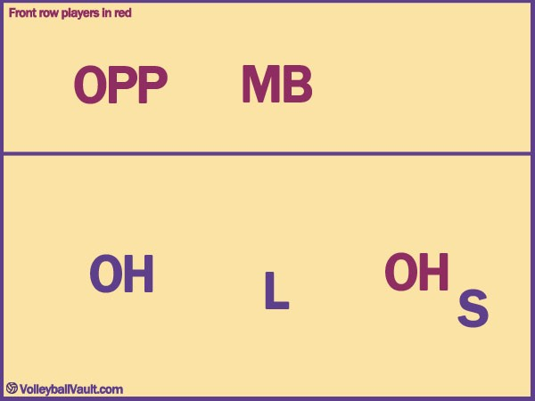
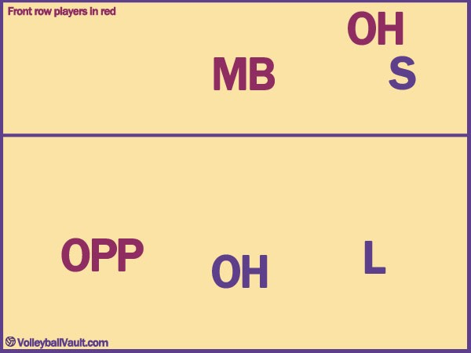
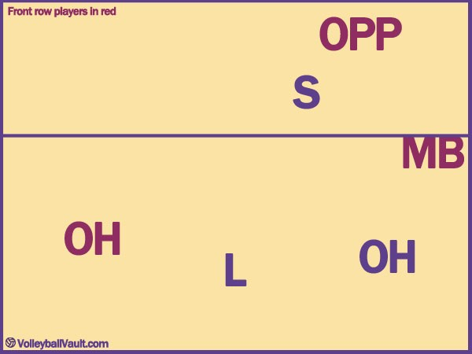
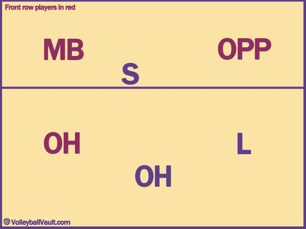
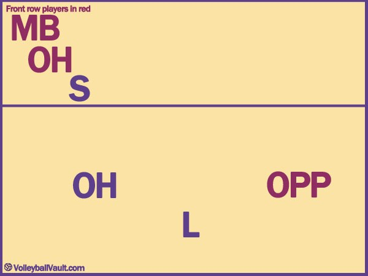
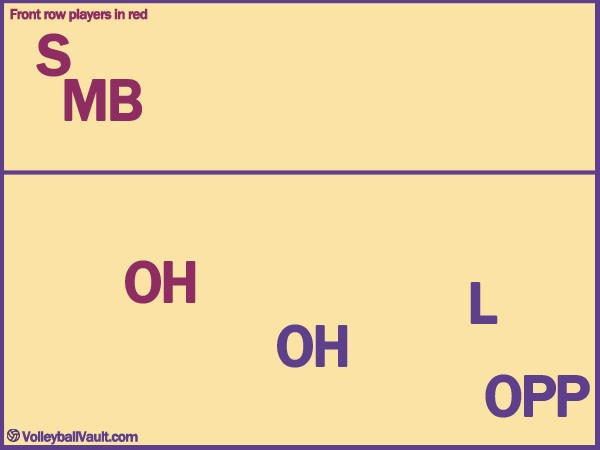
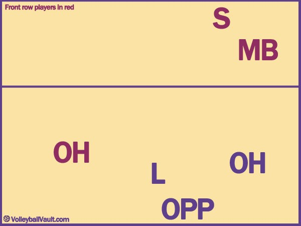
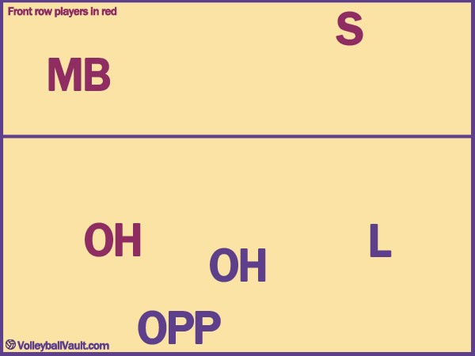

# Guide du Système de Rotation 5-1 au Volleyball

Le système **5-1** est l'un des systèmes de jeu les plus utilisés au volleyball de haut niveau. Il utilise **un seul passeur** (Setter) et **cinq attaquants**.

## Pourquoi utiliser le 5-1 ?
*   **Constance :** Les attaquants s'habituent au style d'un seul passeur.
*   **Spécialisation :** Chaque joueur a un rôle très défini, ce qui optimise les performances collectives.

---

## Les Rôles
- **S (Passeur / Setter) :** Le cerveau de l'équipe. Il distribue le jeu.
- **OH (Réceptionneur-Attaquant / Outside Hitter) :** Attaque à l'aile gauche et participe à la réception. Il y en a deux, opposés dans la rotation.
- **MB (Central / Middle Blocker) :** Attaque au centre et bloque. Il y en a deux, opposés. Souvent remplacés par le Libero en zone arrière.
- **OPP (Pointu / Opposite) :** Attaquant puissant opposé au passeur. Il n'assure généralement pas la réception.
- **L (Libero) :** Spécialiste de la défense et de la réception.

---

## Règles de Base du Placement
1. **Le Chevauchement (Overlapping) :** Avant le service, chaque joueur doit respecter sa position relative (devant/derrière son partenaire de colonne, et à gauche/droite de son partenaire de ligne).
2. **Le "Switch" :** Dès que la balle est servie, les joueurs courent vers leurs positions de spécialité (ex: le Central vers le centre).

---

## Les 6 Rotations (Réception de Service)

### Rotation 1 (Passeur en Poste 1)

Le passeur est à l'arrière droite. C'est la position de départ classique.
*   **Explication :** Le passeur se cache derrière le Réceptionneur-Attaquant (OH) pour monter rapidement au filet dès le service adverse. Le Pointu (OPP) est en poste 4 (devant gauche).

### Rotation 2 (Passeur en Poste 6)

Le passeur est au centre de la zone arrière.
*   **Explication :** Pour éviter le chevauchement, le passeur reste derrière le Central (MB). Les deux OH et le Libero couvrent la réception. Le passeur doit courir entre les joueurs pour atteindre la zone de passe.

### Rotation 3 (Passeur en Poste 5)

Le passeur est à l'arrière gauche.
*   **Explication :** C'est souvent une rotation délicate. Le passeur doit traverser tout le terrain pour arriver à sa position de passe habituelle (entre le poste 2 et 3). On "pousse" souvent le OH vers la droite pour libérer le couloir au passeur.

### Rotation 4 (Passeur en Poste 4) - Passeur en Zone Avant

Le passeur passe devant. Il n'y a plus que 2 attaquants en zone avant (le Central et l'OH).
*   **Explication :** Le passeur est déjà près du filet. Le Pointu (OPP) est maintenant à l'arrière et peut attaquer derrière la ligne des 3 mètres ("attaque aux 3 mètres").

### Rotation 5 (Passeur en Poste 3)

Le passeur est au centre du filet.
*   **Explication :** Le passeur est idéalement placé. Le Central (MB) se décale légèrement pour ne pas gêner, et l'OH de devant se prépare à l'aile gauche.

### Rotation 6 (Passeur en Poste 2)

Le passeur est à l'avant droite.
*   **Explication :** C'est la position la plus simple pour un passeur en zone avant. Il est déjà dans sa "cible". Les attaquants s'organisent autour de lui.

---
